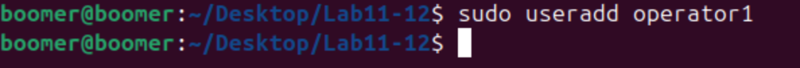
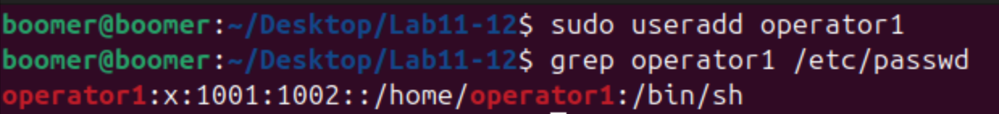
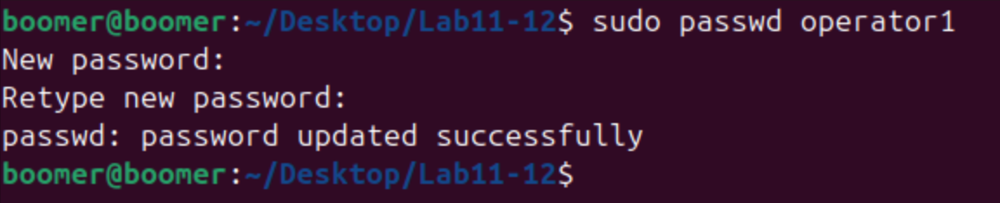
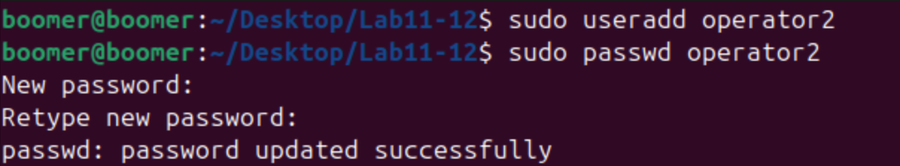
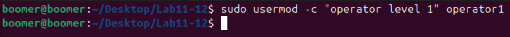
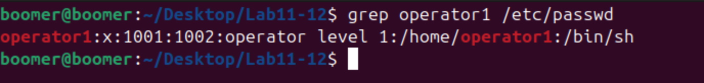
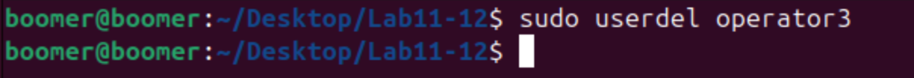
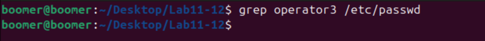

# Lab 11-12: User Management in Linux

## Objective
The objective of this lab is to learn how to create, modify, and remove user accounts in Linux using commands like `useradd`, `passwd`, `usermod`, and `userdel`.

---

## Commands and Concepts Used

### 1. Creating User Accounts

#### a. **`useradd` Command**
The `useradd` command is used to create a new user account in Linux.

##### Example 1: Create the operator1 User
```bash
sudo useradd operator1
```

#### Screenshot:


##### Example 2: Verify User Creation
To confirm that the user exists in the system, you can check the `/etc/passwd` file:
```bash
grep operator1 /etc/passwd
```

#### Screenshot:


---

### 2. Setting and Changing Passwords

#### a. **`passwd` Command**
The `passwd` command is used to set or change passwords for user accounts.

##### Example 1: Set Password for operator1
```bash
sudo passwd operator1
```

#### Screenshot:


---

### 3. Creating Additional Users

#### a. **Creating Multiple Users**
Creating additional users follows the same pattern as creating the first user.

##### Example 1: Create operator2 User
```bash
sudo useradd operator2
```

##### Example 2: Set Password for operator2
```bash
sudo passwd operator2
```

#### Screenshot:


##### Example 3: Create operator3 User
```bash
sudo useradd operator3
```

##### Example 4: Set Password for operator3
```bash
sudo passwd operator3
```

#### Screenshot:


---

### 4. Modifying User Accounts

#### a. **`usermod` Command**
The `usermod` command is used to modify a user account's settings.

##### Example: Update Comments for operator1
The `-c` option allows you to add a comment (typically used for the user's full name or description).
```bash
sudo usermod -c "Operator Level 1" operator1
```

#### Screenshot:


##### Verification: Check Updated User Information
```bash
grep operator1 /etc/passwd
```

#### Screenshot:



---

### 5. Removing User Accounts

#### a. **`userdel` Command**
The `userdel` command is used to delete a user account from the system.

##### Example: Remove operator3 User
```bash
sudo userdel operator3
```

#### Screenshot:


##### Verification: Confirm User Removal
```bash
grep operator3 /etc/passwd
```

#### Screenshot:


---

## Additional User Management Commands

### 1. Viewing All Users in the System
```bash
cat /etc/passwd
```

### 2. Creating a User with a Home Directory
```bash
sudo useradd -m username
```

### 3. Creating a User with a Specific Shell
```bash
sudo useradd -s /bin/bash username
```

### 4. Locking and Unlocking User Accounts
```bash
# Lock a user account
sudo passwd -l username

# Unlock a user account
sudo passwd -u username
```

---

## Conclusion
In this lab, you learned how to:
1. Create new user accounts using `useradd`
2. Set and change passwords using `passwd`
3. Modify user account information using `usermod`
4. Remove user accounts using `userdel`

These skills are essential for user management and system administration in Linux environments.

---
