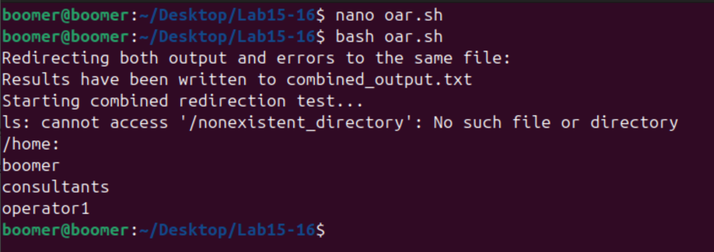

# Lab 15 & 16: Shell Scripting and Redirection Operators in Linux

## Objective
The objective of this lab is to create shell scripts that print system information, perform basic mathematical calculations, and use redirection operators to store command outputs.

---

## Commands and Concepts Used

### 1. Shell Scripts for System Information

#### a. **Creating a Basic System Information Script**

##### Example 1: Create a script to display system information
```bash
#!/bin/bash
# A script to display basic system information

echo "-------------------------"
echo "SYSTEM INFORMATION"
echo "-------------------------"
echo "Hostname: $(hostname)"
echo "Kernel Version: $(uname -r)"
echo "System Architecture: $(uname -m)"
echo "Operating System: $(cat /etc/os-release | grep PRETTY_NAME | cut -d'"' -f2)"
echo "Uptime: $(uptime -p)"
echo "-------------------------"
```

#### Screenshot:


##### Example 2: Creating a script to display disk usage
```bash
#!/bin/bash
# A script to display disk usage information

echo "-------------------------"
echo "DISK USAGE INFORMATION"
echo "-------------------------"
echo "Filesystem usage:"
df -h | grep -v "tmpfs"
echo ""
echo "Top 5 directories by size:"
du -h /home | sort -rh | head -5
echo "-------------------------"
```

#### Screenshot:


---

#### b. **Creating a Script to Monitor System Resources**

##### Example: Script to monitor CPU, memory, and processes
```bash
#!/bin/bash
# A script to monitor system resources

echo "-------------------------"
echo "SYSTEM RESOURCE MONITOR"
echo "-------------------------"
echo "Date & Time: $(date)"
echo ""
echo "CPU Information:"
echo "-------------------------"
lscpu | grep "Model name\|CPU(s)\|CPU MHz"
echo ""
echo "Memory Usage:"
echo "-------------------------"
free -h
echo ""
echo "Top 5 CPU-consuming processes:"
echo "-------------------------"
ps aux --sort=-%cpu | head -6
echo ""
echo "Top 5 Memory-consuming processes:"
echo "-------------------------"
ps aux --sort=-%mem | head -6
echo "-------------------------"
```

#### Screenshot:


---

#### c. **Creating a Script to Display Network Information**

##### Example: Script to display network interfaces and connections
```bash
#!/bin/bash
# A script to display network information

echo "-------------------------"
echo "NETWORK INFORMATION"
echo "-------------------------"
echo "Network Interfaces:"
ip addr | grep -E "^[0-9]+:|inet " | grep -v "inet6"
echo "-------------------------"
```

#### Screenshot:


---

### 2. Shell Scripts for Mathematical Calculations

#### a. **Basic Arithmetic Operations**

##### Example 1: Script for arithmetic operations
```bash
#!/bin/bash
# A script to perform basic arithmetic operations

echo "-------------------------"
echo "BASIC CALCULATOR"
echo "-------------------------"

# Input two numbers
echo "Enter first number:"
read num1
echo "Enter second number:"
read num2

# Perform calculations
sum=$((num1 + num2))
difference=$((num1 - num2))
product=$((num1 * num2))

# Handle division by zero
if [ $num2 -eq 0 ]; then
    division="Cannot divide by zero"
else
    division=$((num1 / num2))
    remainder=$((num1 % num2))
fi

# Display results
echo "-------------------------"
echo "Results:"
echo "Addition: $num1 + $num2 = $sum"
echo "Subtraction: $num1 - $num2 = $difference"
echo "Multiplication: $num1 * $num2 = $product"
if [ $num2 -eq 0 ]; then
    echo "Division: $division"
else
    echo "Division: $num1 / $num2 = $division"
    echo "Remainder: $num1 % $num2 = $remainder"
fi
echo "-------------------------"
```

#### Screenshot:


---

#### b. **Advanced Mathematical Operations**

##### Example: Script for more complex calculations
```bash
#!/bin/bash
# A script for advanced mathematical calculations using bc

echo "-------------------------"
echo "ADVANCED CALCULATOR"
echo "-------------------------"

# Input two numbers
echo "Enter first number (can be decimal):"
read num1
echo "Enter second number (can be decimal):"
read num2

# Perform calculations using bc
sum=$(echo "$num1 + $num2" | bc)
difference=$(echo "$num1 - $num2" | bc)
product=$(echo "$num1 * $num2" | bc)

# Handle division by zero
if (( $(echo "$num2 == 0" | bc -l) )); then
    division="Cannot divide by zero"
else
    division=$(echo "scale=4; $num1 / $num2" | bc)
fi

# Power and square root
power=$(echo "$num1 ^ 2" | bc)
sqrt=$(echo "scale=4; sqrt($num1)" | bc -l)

# Display results
echo "-------------------------"
echo "Results:"
echo "Addition: $num1 + $num2 = $sum"
echo "Subtraction: $num1 - $num2 = $difference"
echo "Multiplication: $num1 * $num2 = $product"
echo "Division: $num1 / $num2 = $division"
echo "Square of $num1 = $power"
echo "Square root of $num1 = $sqrt"
echo "-------------------------"
```

#### Screenshot:


---

#### c. **Area and Volume Calculator**

##### Example: Script to calculate area and volume of various shapes
```bash
#!/bin/bash
# A script to calculate area and volume

echo "-------------------------"
echo "AREA & VOLUME CALCULATOR"
echo "-------------------------"
echo "1. Calculate area of a circle"
echo "2. Calculate area of a rectangle"
echo "3. Calculate area of a triangle"
echo "4. Calculate volume of a cube"
echo "5. Calculate volume of a sphere"
echo "-------------------------"
echo "Enter your choice (1-5):"
read choice

case $choice in
    1)
        echo "Enter radius of circle:"
        read radius
        area=$(echo "scale=2; 3.14159 * $radius * $radius" | bc)
        echo "Area of circle = $area square units"
        ;;
    2)
        echo "Enter length of rectangle:"
        read length
        echo "Enter width of rectangle:"
        read width
        area=$(echo "$length * $width" | bc)
        echo "Area of rectangle = $area square units"
        ;;
    3)
        echo "Enter base of triangle:"
        read base
        echo "Enter height of triangle:"
        read height
        area=$(echo "scale=2; 0.5 * $base * $height" | bc)
        echo "Area of triangle = $area square units"
        ;;
    4)
        echo "Enter side length of cube:"
        read side
        volume=$(echo "$side * $side * $side" | bc)
        echo "Volume of cube = $volume cubic units"
        ;;
    5)
        echo "Enter radius of sphere:"
        read radius
        volume=$(echo "scale=2; (4/3) * 3.14159 * $radius * $radius * $radius" | bc)
        echo "Volume of sphere = $volume cubic units"
        ;;
    *)
        echo "Invalid choice"
        ;;
esac
```

#### Screenshot:


---

### 3. Using Redirection Operators

#### a. **Standard Output Redirection (>)**

##### Example 1: Redirecting output to a file
```bash
#!/bin/bash
# A script demonstrating output redirection

echo "This is a demonstration of output redirection."
echo "System information at $(date)" > system_info.txt
echo "Hostname: $(hostname)" >> system_info.txt
echo "Kernel Version: $(uname -r)" >> system_info.txt
echo "System Architecture: $(uname -m)" >> system_info.txt
echo "Data has been written to system_info.txt"
```

#### Screenshot:


##### Example 2: Overwriting vs. Appending
```bash
#!/bin/bash
# A script showing the difference between > and >>

echo "Demonstrating overwrite (>):"
echo "First line" > overwrite_demo.txt
cat overwrite_demo.txt
echo "Another line" > overwrite_demo.txt
cat overwrite_demo.txt

echo -e "\nDemonstrating append (>>):"
echo "First line" > append_demo.txt
cat append_demo.txt
echo "Second line" >> append_demo.txt
cat append_demo.txt
```

#### Screenshot:


---

#### b. **Standard Error Redirection (2>)**

##### Example: Redirecting error messages
```bash
#!/bin/bash
# A script demonstrating error redirection

echo "Demonstrating error redirection:"
# This will generate an error
ls /nonexistent_directory 2> error.txt
echo "Error messages have been redirected to error.txt"
cat error.txt
```

#### Screenshot:


---

#### c. **Redirecting Both Standard Output and Error (2>&1)**

##### Example: Redirecting both output and errors to the same file
```bash
#!/bin/bash
# A script showing combined output and error redirection

echo "Redirecting both output and errors to the same file:"
echo "Starting combined redirection test..." > combined_output.txt
ls /home /nonexistent_directory >> combined_output.txt 2>&1
echo "Results have been written to combined_output.txt"
cat combined_output.txt
```

#### Screenshot:


---

#### d. **Using Redirection with Pipes**

##### Example: Combining redirection with pipes
```bash
#!/bin/bash
# A script demonstrating redirection with pipes

echo "Top 5 CPU-consuming processes:"
ps aux --sort=-%cpu | head -6 | tee cpu_processes.txt
echo "The list has also been saved to cpu_processes.txt"

echo -e "\nFiles larger than 100MB:"
find /home -type f -size +100M 2>/dev/null | tee large_files.txt
echo "The list has also been saved to large_files.txt"
```

#### Screenshot:


---

#### e. **Here Documents (<<)**

##### Example: Using here documents in scripts
```bash
#!/bin/bash
# A script demonstrating here documents

cat << EOF > report.txt
===================================
SYSTEM REPORT
===================================
Date: $(date)
Hostname: $(hostname)
Kernel: $(uname -r)
Architecture: $(uname -m)
===================================
Memory Usage:
$(free -h)
===================================
Disk Usage:
$(df -h)
===================================
EOF

echo "Report has been generated and saved to report.txt"
```

#### Screenshot:


---

### 4. Combining Scripts and Redirection

#### a. **Creating a System Monitoring Script with Automated Reporting**

##### Example: Script that generates a detailed system report
```bash
#!/bin/bash
# A script that generates a system report using redirection

# Create a timestamp for the filename
timestamp=$(date +"%Y%m%d_%H%M%S")
report_file="system_report_$timestamp.txt"

# Generate the report
{
    echo "========================================"
    echo "SYSTEM REPORT - $(date)"
    echo "========================================"
    echo
    
    echo "SYSTEM INFORMATION:"
    echo "--------------------------------------"
    echo "Hostname: $(hostname)"
    echo "Kernel: $(uname -r)"
    echo "Architecture: $(uname -m)"
    echo "Operating System: $(cat /etc/os-release | grep PRETTY_NAME | cut -d'"' -f2)"
    echo "Uptime: $(uptime -p)"
    echo
    
    echo "CPU INFORMATION:"
    echo "--------------------------------------"
    lscpu | grep "Model name\|CPU(s)\|CPU MHz"
    echo
    
    echo "MEMORY USAGE:"
    echo "--------------------------------------"
    free -h
    echo
    
    echo "DISK USAGE:"
    echo "--------------------------------------"
    df -h | grep -v "tmpfs"
    echo
    
    echo "TOP 5 CPU-CONSUMING PROCESSES:"
    echo "--------------------------------------"
    ps aux --sort=-%cpu | head -6
    echo
    
    echo "TOP 5 MEMORY-CONSUMING PROCESSES:"
    echo "--------------------------------------"
    ps aux --sort=-%mem | head -6
    echo
    
    echo "NETWORK INFORMATION:"
    echo "--------------------------------------"
    ip addr | grep -E "^[0-9]+:|inet " | grep -v "inet6"
    echo
    
    echo "ACTIVE CONNECTIONS:"
    echo "--------------------------------------"
    netstat -tuln
    echo
    
    echo "LOGGED-IN USERS:"
    echo "--------------------------------------"
    who
    echo
    
    echo "========================================" 
    echo "END OF REPORT"
    echo "========================================"
} > "$report_file" 2>&1

echo "System report has been generated and saved to $report_file"
```

#### Screenshot:


---

## Conclusion

In this lab, you learned how to:
1. Create shell scripts to gather and display system information
2. Write scripts that perform basic and advanced mathematical calculations
3. Use redirection operators to store command outputs
4. Combine scripts and redirection to create automated system reports

These skills are essential for system administration, automation, and creating useful tools for Linux environments. Shell scripting allows you to automate repetitive tasks, perform complex operations, and generate reports that can be used for monitoring and troubleshooting.

---
