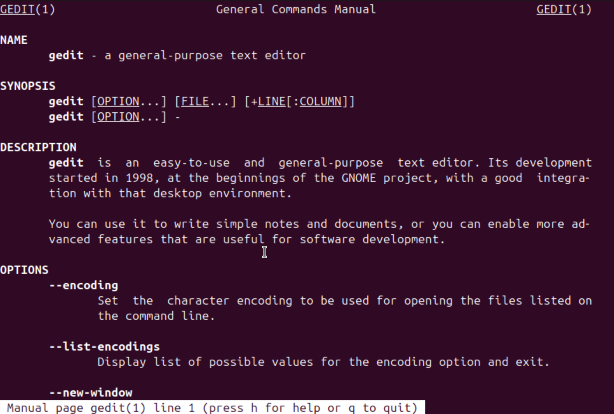
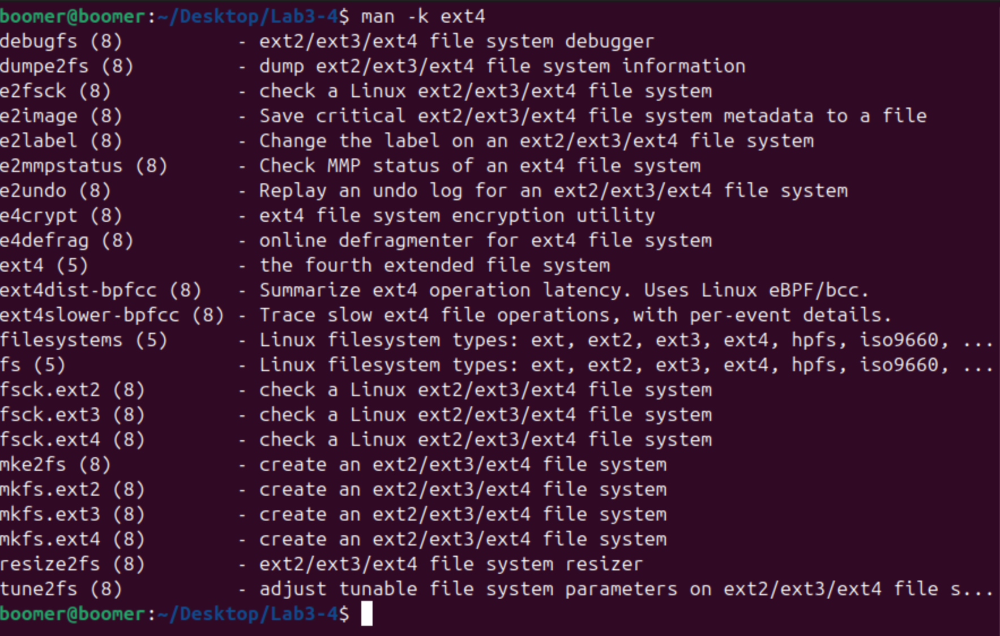
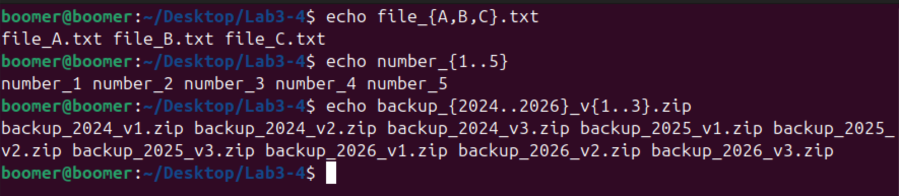

# Lab 3 & 4: Using man Pages, Searching Commands, and Brace Expansion in Linux

## Objective
The objective of this lab is to explore Linux manual (`man`) pages, search for commands related to `ext4`, and understand the usage of **brace expansion** for generating discretionary strings of characters.

## Commands Used

### Viewing the `gedit` man Page
To view the manual page for `gedit`, use the `man` command:
```bash
man gedit
```
#### Explanation:
- The `man` command displays the manual page for a specified command.
- `gedit` is a text editor for the GNOME desktop environment.

### Searching for Commands Related to `ext4`
To find commands related to `ext4` file-system tuning, use:
```bash
man -k ext4
```
#### Explanation:
- The `-k` option searches the manual page descriptions for the given keyword (`ext4`).
- This helps in identifying relevant commands for tuning the ext4 file system.

### Using Brace Expansion
Brace expansion generates arbitrary strings of characters. It can be used for creating lists or sequences efficiently.

#### Example 1: Generating a List of Strings
```bash
echo file_{A,B,C}.txt
```
**Output:**
```
file_A.txt file_B.txt file_C.txt
```

#### Example 2: Generating a Sequence of Numbers
```bash
echo number_{1..5}
```
**Output:**
```
number_1 number_2 number_3 number_4 number_5
```

#### Example 3: Combining Text with Brace Expansion
```bash
echo backup_{2024..2026}_v{1..3}.zip
```
**Output:**
```
backup_2024_v1.zip backup_2024_v2.zip backup_2024_v3.zip backup_2025_v1.zip backup_2025_v2.zip backup_2025_v3.zip backup_2026_v1.zip backup_2026_v2.zip backup_2026_v3.zip
```

## Verifying Command Execution
After running the above commands, verify outputs using:
```bash
man gedit
man -k ext4
echo file_{A,B,C}.txt
echo number_{1..5}z
```

### Screenshots
Below are screenshots demonstrating the execution of commands

#### 1. Viewing the `gedit` man page:



#### 2. Searching for `ext4` commands:


#### 3. Using brace expansion:


## Conclusion
In this lab, we explored `man` pages, searched for `ext4` commands using `man -k`, and demonstrated the power of **brace expansion** for generating multiple strings efficiently. These concepts help in effective command-line usage and scripting in Linux.

