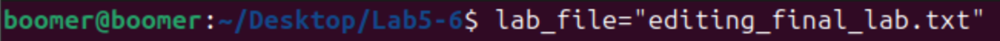
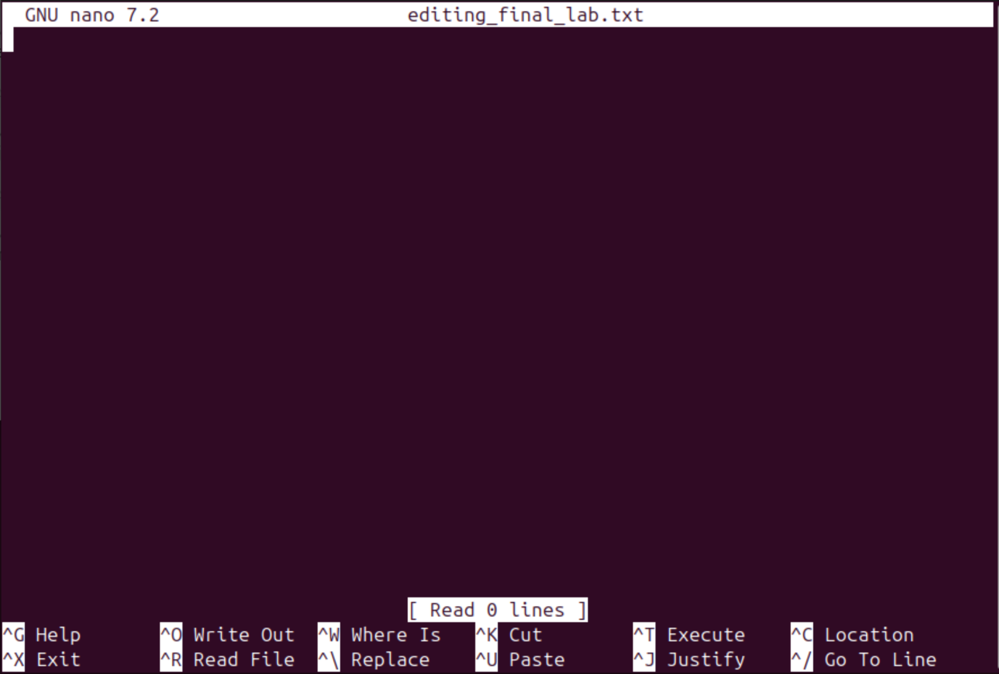
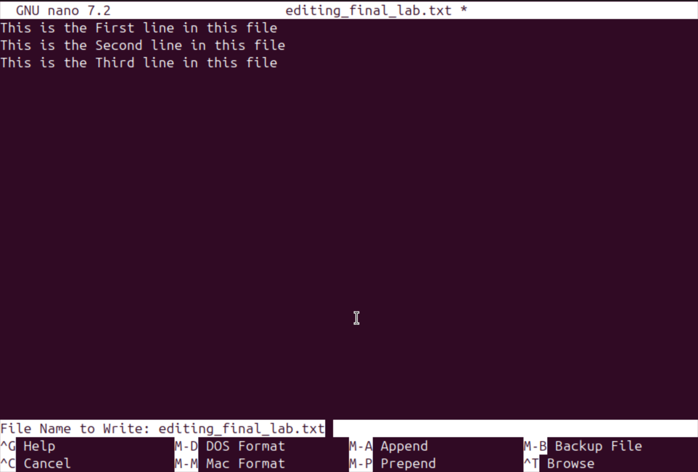
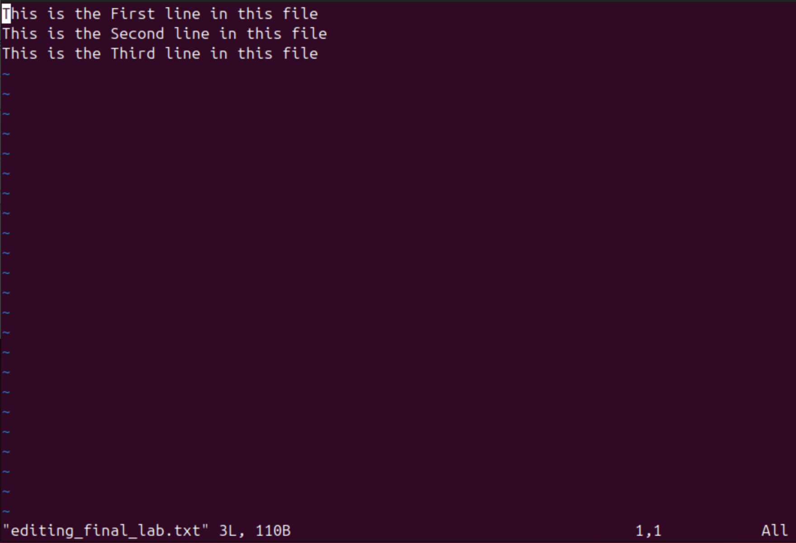
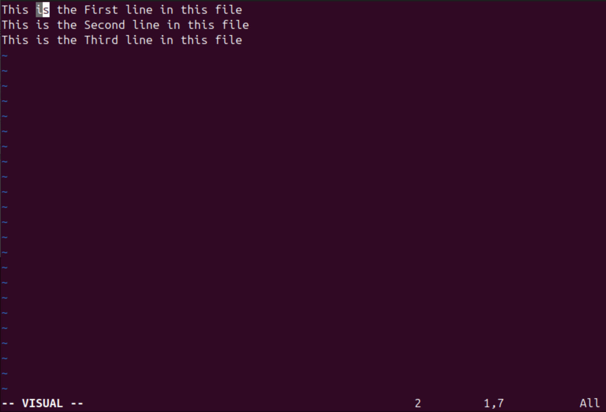
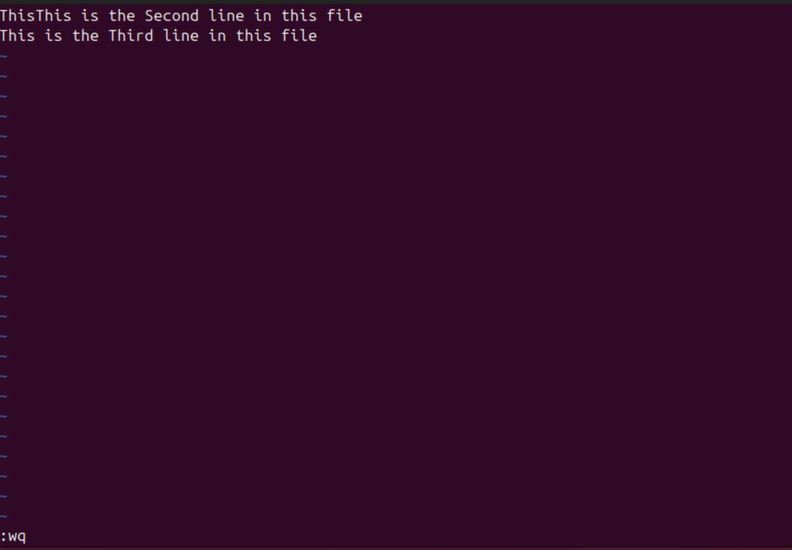
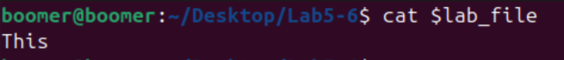

# Lab 5 & 6: Using Vim and Nano to Edit Files in Linux

## Objective
The objective of this lab is to familiarize yourself with two popular text editors in Linux: **Vim** and **Nano**. You will use these editors to modify the `editing_final_lab.txt` file, manipulate text using Vim's visual mode, and perform specific edits such as removing characters and preserving specific portions of text.

---

## Commands and Concepts Used

### 1. Setting Up the Lab File
Before starting, ensure you have the `editing_final_lab.txt` file. If it doesn't exist, create it using the following command:
```bash
touch editing_final_lab.txt
```


To store the file path in a shell variable for easier access:
```bash
lab_file="editing_final_lab.txt"
```

#### Screenshot:


---

### 2. Editing with Nano
Nano is a simple and user-friendly text editor. To open the file in Nano:
```bash
nano $lab_file
```

#### Screenshot:


#### Tasks in Nano:
1. Add the following text to the file:
   ```
   This is the first line of the file.
   This is the second line of the file.
   This is the third line of the file.
   ```


2. Save the file by pressing `CTRL + O`, then exit Nano by pressing `CTRL + X`.

#### Screenshot:


---

### 3. Editing with Vim
Vim is a powerful and highly configurable text editor. To open the file in Vim:
```bash
vim $lab_file
```

#### Screenshot:


#### Tasks in Vim:
1. **Enter Visual Mode**:
   - Move the cursor to the first line.
   - Press `v` to enter visual mode.

#### Screenshot:


2. **Remove the Last Seven Characters from the First Column**:
   - In visual mode, highlight the last seven characters of the first line.
   - Press `d` to delete the highlighted text.


3. **Preserve Only the First Four Characters of the First Column**:
   - Move the cursor to the beginning of the first line.
   - Press `4l` to move the cursor to the fourth character.
   - Press `v` to enter visual mode, then highlight the remaining characters after the fourth character.
   - Press `d` to delete the highlighted text.


4. **Save and Exit**:
   - Press `ESC` to ensure you're in command mode.
   - Type `:wq` and press `Enter` to save and exit Vim.

#### Screenshot:


---

## Verifying Command Execution
After completing the tasks, verify the contents of the file using:
```bash
cat $lab_file
```

#### Screenshot:


### Expected Output:
If the file initially contained:
```
This is the first line of the file.
This is the second line of the file.
This is the third line of the file.
```

After editing with Vim, the first line should be:
```
This
```

---

## Conclusion
In this lab, you learned how to use **Nano** and **Vim** to edit files in Linux. You practiced basic text manipulation in Vim, including entering visual mode, deleting specific characters, and preserving portions of text. These skills are essential for efficient file editing and scripting in Linux.

---
