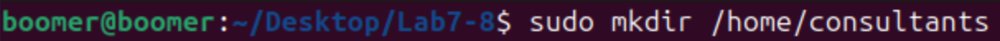
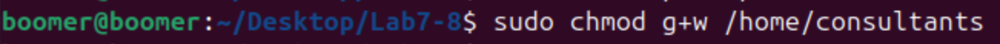
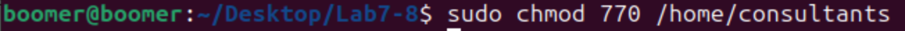
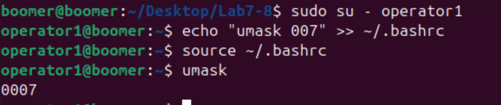
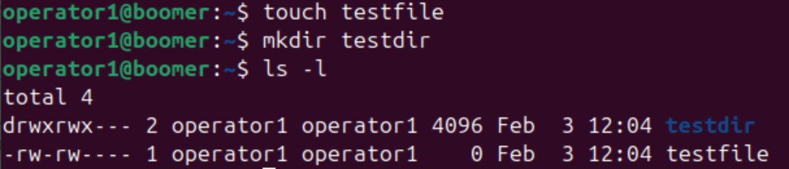

# Lab 7 & 8: Managing Permissions and Directories in Linux

## Objective
The objective of this lab is to learn how to manage directories, set permissions using both symbolic and octal methods, and configure the `umask` for a user. You will create a directory, modify its permissions, and ensure proper access control for groups and users.

---

## Commands and Concepts Used

### 1. Create the `/home/consultants` Directory
To create the `/home/consultants` directory, use the `mkdir` command:
```bash
sudo mkdir /home/consultants
```

#### Screenshot:


---

### 2. Add Write Permission to the `consultants` Group
To add write permission to the `consultants` group, use the `chmod` command with the symbolic method:
```bash
sudo chmod g+w /home/consultants
```

#### Explanation:
- `g+w`: Adds write (`w`) permission for the group (`g`).

#### Screenshot:


---

### 3. Forbid Others from Accessing the Directory
To forbid others from accessing the `/home/consultants` directory, use the `chmod` command with the octal method:
```bash
sudo chmod 770 /home/consultants
```

#### Explanation:
- `770`: 
  - `7` (owner): Read, write, and execute permissions.
  - `7` (group): Read, write, and execute permissions.
  - `0` (others): No permissions.

#### Screenshot:


---

### 4. Verify Permissions
To verify the permissions of the `/home/consultants` directory, use the `ls -ld` command:
```bash
ls -ld /home/consultants
```

#### Expected Output:
```
drwxrwx--- 2 root consultants 4096 Oct 10 12:34 /home/consultants
```

#### Screenshot:


---

### 5. Change the Default `umask` for the `operator1` User
The `umask` determines the default permissions for newly created files and directories. To change the `umask` for the `operator1` user, follow these steps:

1. Switch to the `operator1` user:
   ```bash
   sudo su - operator1
   ```

2. Set the new `umask` value in the user's shell configuration file (e.g., `.bashrc`):
   ```bash
   echo "umask 007" >> ~/.bashrc
   ```

3. Apply the changes:
   ```bash
   source ~/.bashrc
   ```

4. Verify the new `umask`:
   ```bash
   umask
   ```

#### Explanation:
- `umask 007`: 
  - `0` (owner): Full permissions (default).
  - `0` (group): Full permissions (default).
  - `7` (others): No permissions.

#### Screenshot:


---

### 6. Confirm the `umask` is Applied
To confirm that the `umask` is applied, create a new file or directory and check its permissions:
```bash
touch testfile
mkdir testdir
ls -l
```

#### Expected Output:
- File permissions: `-rw-rw----`
- Directory permissions: `drwxrwx---`

#### Screenshot:


---

## Conclusion
In this lab, you learned how to:
1. Create directories and manage their permissions using both symbolic and octal methods.
2. Restrict access to specific groups and users.
3. Configure the `umask` for a user to control default file and directory permissions.

These skills are essential for managing file systems and ensuring proper access control in Linux environments.

---