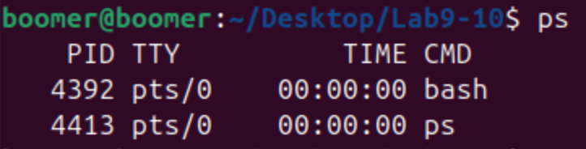
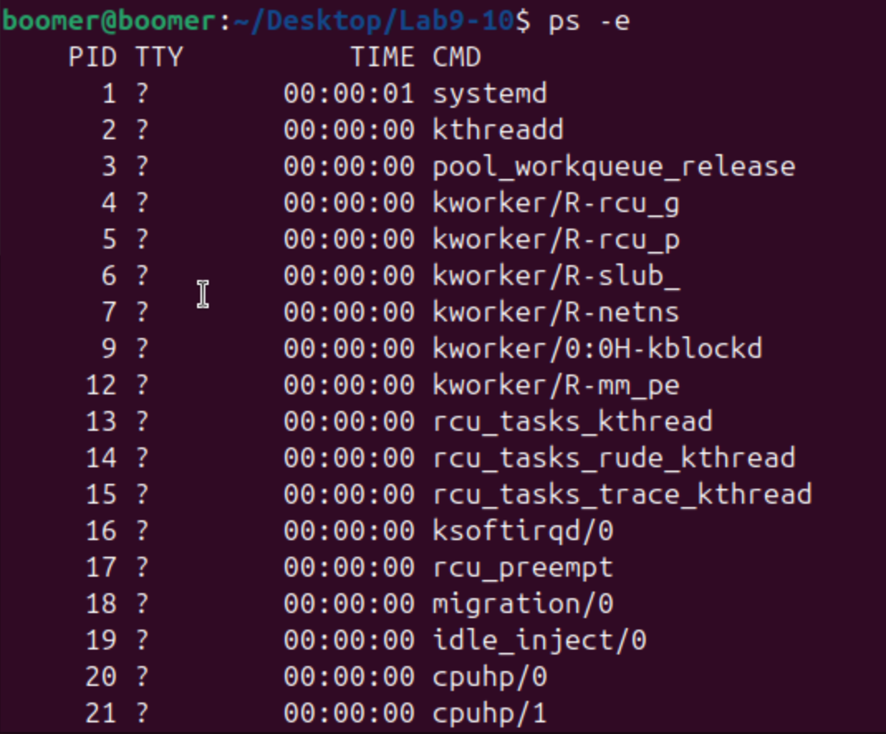
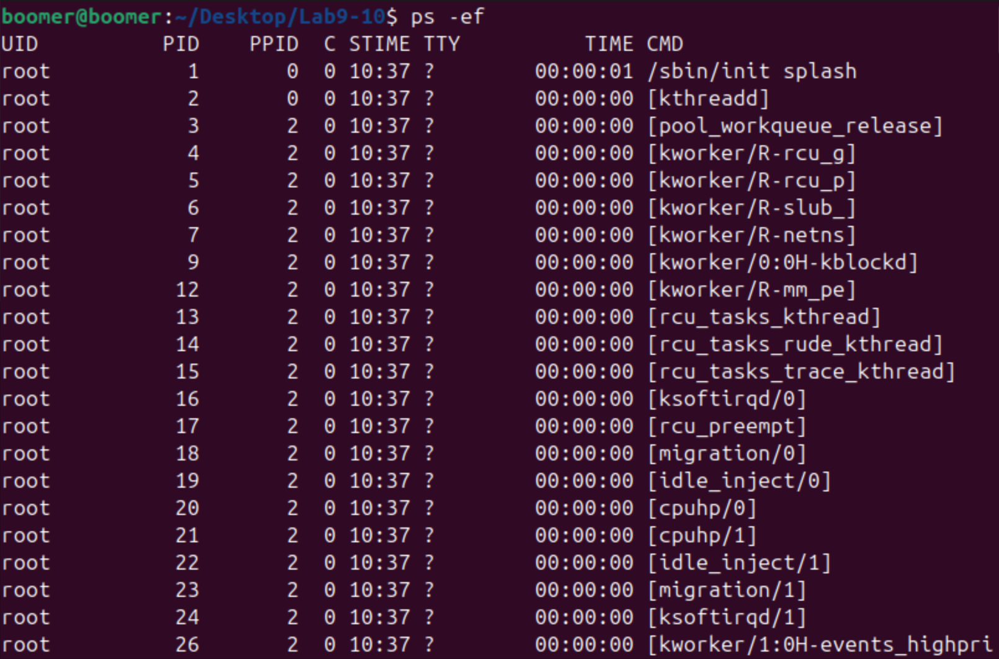
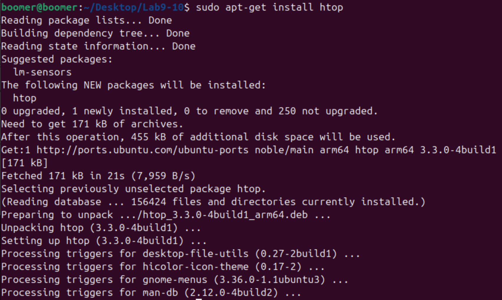
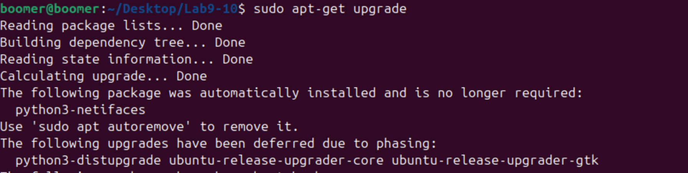
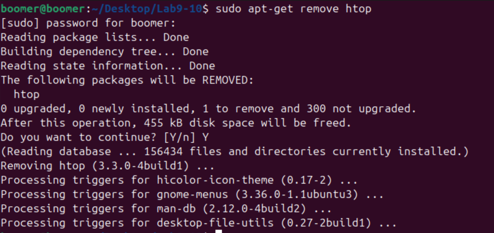
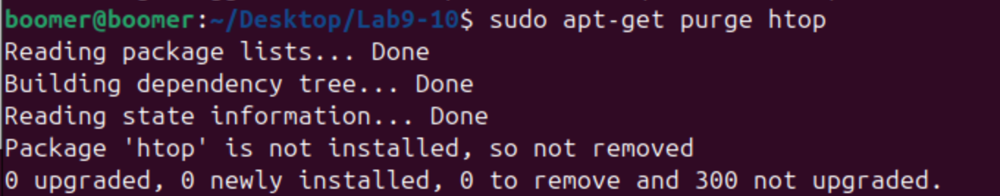
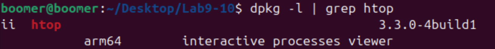

# Lab 9 & 10: Process Management and Software Management in Linux

## Objective
The objective of this lab is to learn how to manage processes using commands like `ps`, `top`, and `kill`, and to understand how to install, update, and remove software using the `apt-get` command in Linux.

---

## Commands and Concepts Used

### 1. Process Management Commands

#### a. **`ps` Command**
The `ps` command is used to display information about active processes.

##### Example 1: Display Processes for the Current User
```bash
ps
```

#### Screenshot:


##### Example 2: Display All Processes
```bash
ps -e
```

#### Screenshot:


##### Example 3: Display Processes in Full Format
```bash
ps -ef
```

#### Screenshot:


---

#### b. **`top` Command**
The `top` command provides a real-time view of system processes.

##### Example: Run `top` to Monitor Processes
```bash
top
```

#### Screenshot:


---

#### c. **`kill` Command**
The `kill` command is used to terminate processes.

##### Example 1: Terminate a Process by PID
First, find the PID of the process using `ps` or `top`, then terminate it:
```bash
kill <PID>
```

#### Screenshot:


##### Example 2: Forcefully Terminate a Process
```bash
kill -9 <PID>
```

#### Screenshot:


---

### 2. Software Management with `apt-get`

#### a. **Installing Software**
To install a software package, use the `apt-get install` command.

##### Example: Install `htop`
```bash
sudo apt-get install htop
```

#### Screenshot:


---

#### b. **Updating Software**
To update the list of available packages and their versions, use:
```bash
sudo apt-get update
```

#### Screenshot:


To upgrade installed packages to their latest versions, use:
```bash
sudo apt-get upgrade
```

#### Screenshot:


---

#### c. **Removing Software**
To remove a software package, use the `apt-get remove` command.

##### Example: Remove `htop`
```bash
sudo apt-get remove htop
```

#### Screenshot:


To remove the package along with its configuration files, use:
```bash
sudo apt-get purge htop
```

#### Screenshot:


---

### 3. Verifying Software Installation and Removal
To verify if a package is installed, use the `dpkg` command:
```bash
dpkg -l | grep htop
```

#### Screenshot:


---

## Conclusion
In this lab, you learned how to:
1. Manage processes using `ps`, `top`, and `kill`.
2. Install, update, and remove software using `apt-get`.

These skills are essential for system administration, process monitoring, and software management in Linux.

---
