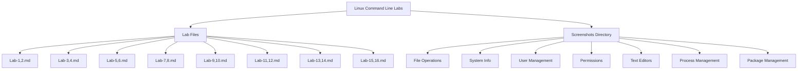

# Linux Command Line Laboratories

  

  

## 📚 Repository Overview

This repository contains a comprehensive collection of Linux command-line laboratory exercises designed to build proficiency in essential system administration tasks. Each lab is meticulously documented with clear instructions and screenshot evidence of command execution.

## 📊 Repository Structure

## 📋 Complete Lab Plan

| Sr. No. | Lab Number | Experiments |
|---------|------------|-------------|
| 1       | 1-2        | Use the touch command to create sets of empty practice files. Create six files with names of the form `songX.mp3`, `snapX.jpg`, `filmX.avi`. Create three subdirectories: `friends`, `family`, and `work` using a single command. |
| 2       | 3-4        | View the `gedit` man page. Use `man -k ext4` to find the command to tune ext4 file-system parameters. Use brace expansion and wildcards for file matching. Explore `cat`, `less`, and `more` commands. |
| 3       | 5-6        | Use `vim` and `nano` to edit files. Use the `lab_file` shell variable. Enter visual mode in Vim, remove the last seven characters of the first column, and preserve only the first four characters. |
| 4       | 7-8        | Create the `/home/consultants` directory. Add write permission to the `consultants` group using symbolic method. Forbid access to others. Change the `umask` for `operator1` user to prohibit all access for non-group users. |
| 5       | 9-10       | Implement `ps`, `top`, and `kill` commands with their options. Install, update, and remove software using `apt-get`. |
| 6       | 11-12      | Create the `operator1` user and set the password. Add `operator2` and `operator3` users with passwords. Use `usermod -c` to update comments for `operator1`. Remove `operator3` from the system. |
| 7       | 13-14      | Use `chown` and `chmod` commands with their options to modify ownership and permissions. |
| 8       | 15-16      | Write shell scripts to print system information and perform basic mathematical calculations. Use redirection operators to store command outputs. |
| 9       | 17-18      | Implement `fdisk`, `parted`, `df`, and `du` commands with their options for disk management. |
| 10      | 19-20      | Use `rsync`, `tar`, and compression commands to efficiently store and transfer files. |
| 11      | 21-22      | Configure system networking using `netplan` and `nmcli`. Set up and configure the system firewall. |
| 12      | 23-24      | Use `top`, `htop`, `iostat`, and `vmstat` to monitor system performance. Tune the system using `sysctl` and `tuned`. Perform log management and analysis using `syslog` and `journalctl`. |
| 13      | 25-26      | Execute `ssh` commands to securely access remote computers. |
| 14      | 27-28      | Run shell scripts to create functions and perform advanced string manipulations. Use `cron` and `at` commands to schedule future tasks. |
| 15      | 29-30      | Create and manage containers to create virtual machines on the system. |

## 🔥 Embark on Your Linux Adventure

  

    <h3>🧭 Begin Your Quest</h3>
    <ol>
      <li><b>Summon the repository:</b>
        <pre><code>git clone https://github.com/Anuj-er/Linux-Administration-Lab-Experiments/ </code></pre>
      </li>
      <li><b>Enter the training grounds:</b>
        <pre><code>cd linux-command-labs</code></pre>
      </li>
      <li><b>Study the ancient scrolls:</b> Each Lab-X,X.md file contains wisdom and challenges</li>
      <li><b>Consult the visual tomes:</b> Screenshots directory holds visual proof of successful incantations</li>
    </ol>
  

  
  

    <blockquote>
      "The journey of a thousand commands begins with a single terminal."
    </blockquote>
  

## 🧠 The Philosophy of Learning Linux

These laboratories are crafted with the wisdom of Red Hat's time-tested pedagogical approach. They embrace a holistic learning philosophy that transforms novices into masters through progressive challenges and hands-on experience.

<table>
  <tr>
    <td width="50%">
      <h3>🔨 Forge Knowledge Through Practice</h3>
      
Theoretical concepts come alive through hands-on exercises that build muscle memory and deep understanding.

    </td>
    <td width="50%">
      <h3>👁️ See To Believe, Do To Understand</h3>
      
Visual demonstrations and verified outputs create a feedback loop that reinforces learning.

    </td>
  </tr>
  <tr>
    <td width="50%">
      <h3>🏗️ Scaffold Your Linux Knowledge</h3>
      
Each lab builds upon previous concepts, creating a solid foundation that supports advanced skills.

    </td>
    <td width="50%">
      <h3>🌐 Learn As You Would Work</h3>
      
Labs simulate real-world scenarios, preparing you for actual system administration challenges.

    </td>
  </tr>
</table>

## 📚 Wisdom Sources

  

    <h3>Red Hat Academy</h3>
    
The foundation of enterprise Linux education

  

  
  

    <h3>RH124</h3>
    
System Administration I

  

  
  

    <h3>RH134</h3>
    
System Administration II

  

  
  

    <h3>Linux Documentation Project</h3>
    
<a href="https://tldp.org/">tldp.org</a>

  

  
  

    <h3>Man Pages</h3>
    
The original Linux knowledge base

  

## 📜 Freedom License

  
This project is licensed under the MIT License - a beacon of open source collaboration that lights the path for all who wish to learn, modify, and share.

  
See the LICENSE file for the full text of digital liberty.

